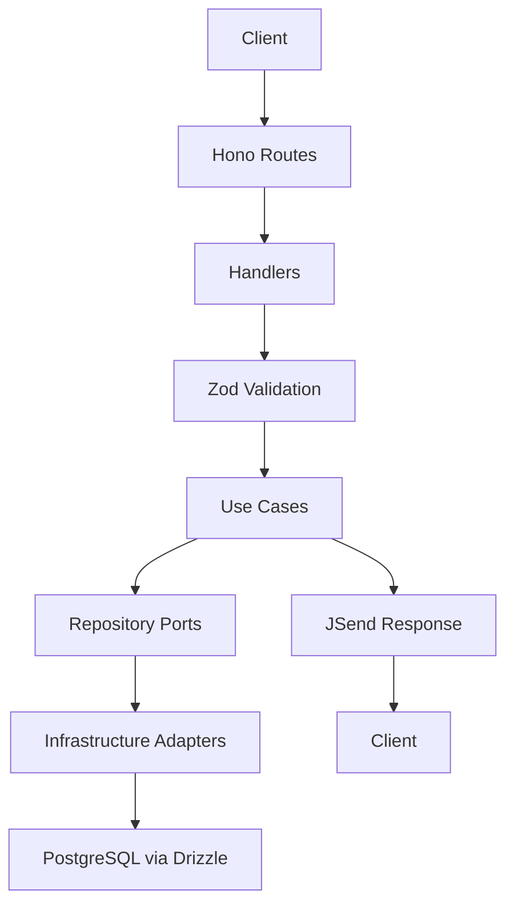

# Architecture

## Overview
Domain-Driven Clean Architecture on Hono with the Bun runtime. Clear boundaries separate delivery, application, domain, and infrastructure concerns. Dependencies point inward, validation is explicit at the edges, and operational concerns are addressed with standard middleware and configuration.

Source of truth:
- brief at .agents/rules/memory-bank/brief.md

## Project Structure
The architecture mirrors the structure described in the brief:

```
.
├── src/
│   ├── app.ts                  # Hono app setup
│   ├── server.ts               # Entry point
│   ├── domains/                # Domain modules
│   │   ├── auth/               # Complete domain
│   │   │   ├── entities/
│   │   │   ├── usecases/
│   │   │   ├── repositories/
│   │   │   ├── handlers/
│   │   │   ├── routes/
│   │   │   ├── models/
│   │   │   └── tests/
│   │   └── posts/              # Another domain
│   ├── infrastructure/         # Shared infra
│   │   ├── database/
│   │   ├── middleware/
│   │   └── config/
│   └── shared/                 # Shared components
│       ├── types/
│       ├── utils/
│       └── container/
├── drizzle/                    # Database migrations
├── docs/                       # OpenAPI docs
├── package.json
├── tsconfig.json
├── drizzle.config.ts
└── compose.yml
```

## Clean Architecture Boundaries
- Delivery
  - Hono routes and handlers
  - Maps HTTP requests to handlers and returns standardized responses
  - Depends on use case interfaces only
- Application (Use Cases)
  - Orchestrates business rules and workflows
  - Depends on domain entities and repository interfaces
- Domain
  - Entities and value objects
  - Pure logic and invariants
- Infrastructure
  - Concrete implementations of repository interfaces and adapters
  - Database, configuration, middleware, logging
- Shared
  - Types, utilities, DI container, tokens

Dependency rules:
- Delivery depends inward on Use Cases and shared contracts
- Use Cases depend inward on Domain and outward only on interfaces
- Infrastructure depends inward to implement interfaces; no inward dependency on infrastructure from core layers
- Shared has no downstream runtime dependencies

## Request Lifecycle
- Routing
  - Hono routes accept HTTP requests and map to handlers
- Validation
  - Zod schemas validate inputs and shape models
- Use case execution
  - Handlers resolve use cases from the DI container and invoke them with validated inputs
- Data access
  - Use cases call repository ports; DI supplies Drizzle-backed implementations
- Response shaping
  - JSend envelopes for success and error formats
- Errors and logging
  - Middleware coordinates safe error handling and structured logs



## Configuration and Environments
- Hierarchical configuration with YAML per environment plus .env overrides
- Precedence
  1. Default/base configuration
  2. Environment-specific YAML
  3. .env for local overrides
  4. Process environment in production
- Expected keys
  - server: port, host
  - database: url
  - auth.jwt: expiresIn
  - cors: origins

## Database and Migrations
- Drizzle ORM for schema and queries
- drizzle-kit for migration generation and application
- Workflow
  - Update schema definitions
  - Generate SQL migrations
  - Apply migrations locally and in CI/deploy

## API Documentation
- Hono OpenAPI generation
- Swagger UI endpoint for discoverability
- Contracts synchronized with schemas and routes

## Error Handling and Logging
- Centralized error middleware
  - Sanitizes details in production
  - Maps validation and domain errors to appropriate status codes
- Structured logging via standard middleware patterns
  - Correlate request context where available

## Security Considerations
- JWT-based authentication via Hono JWT middleware
- Password hashing with bcrypt
- UUIDv7 identifiers
- CORS with explicit allowed origins
- Input validation at all public boundaries
- Avoid leaking internal details in error responses

## Scripts and Commands
Reference scripts defined in the brief’s package.json:

```json
{
  "scripts": {
    "dev": "bun --watch src/server.ts",
    "build": "bun build src/server.ts --outdir ./dist",
    "start": "bun dist/server.js",
    "test": "bun test",
    "test:watch": "bun test --watch",
    "db:generate": "drizzle-kit generate:pg",
    "db:migrate": "bun src/scripts/migrate.ts",
    "db:seed": "bun src/scripts/seed.ts",
    "lint": "eslint src/**/*.ts",
    "format": "prettier --write src/**/*.ts"
  }
}
```

## Acceptance for Architectural Readiness
- Folder structure and dependency direction match Clean Architecture
- DI container registers use cases and repository implementations by tokens
- Configuration validated with environment-aware overrides
- OpenAPI generated and served with Swagger UI
- Tests cover public use cases and critical adapters