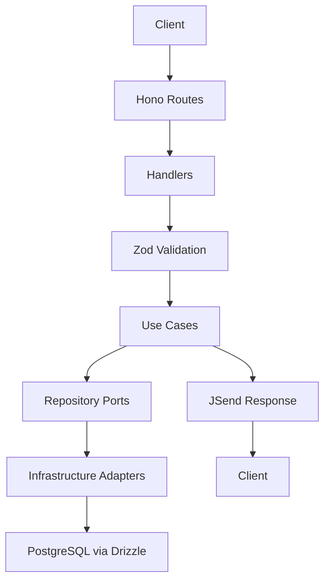
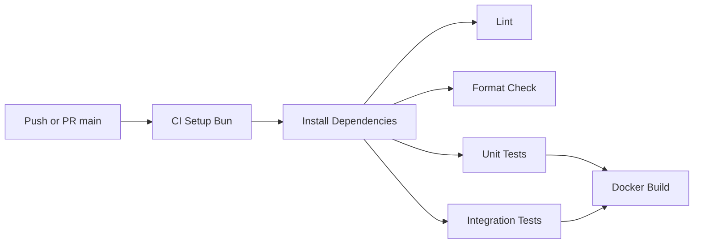

# Architecture

## Overview
A backend mono-repo template built around Domain-Driven Clean Architecture on Hono with Bun runtime. The architecture enforces clear boundaries between domain logic, infrastructure, and delivery, with explicit dependency injection and strong validation and observability practices.

- Architectural style: Domain-Driven Design with Clean Architecture boundaries
- Delivery: Hono HTTP server with OpenAPI and Swagger UI
- Domain: Entities, Use Cases, Repositories, Models per domain
- Infrastructure: Database, config, middleware, logging, adapters
- Shared: Types, utilities, and DI container
- Persistence: PostgreSQL via Drizzle ORM with migrations
- Validation: Zod schemas
- Auth: JWT-based primitives
- IDs: UUIDv7 for index-friendly identifiers

Reference documents:
- Brief at [.agents/rules/memory-bank/brief.md](.agents/rules/memory-bank/brief.md)
- Product at [.agents/rules/memory-bank/product.md](.agents/rules/memory-bank/product.md)
- CI pipeline at [.github/workflows/ci.yml](.github/workflows/ci.yml)

## Intended Mono-repo Structure
While the current repository snapshot is minimal, the intended structure is:

- api service
  - src/app.ts
  - src/server.ts
  - src/domains
    - auth
      - entities, usecases, repositories, handlers, routes, models, tests
    - other domains
  - src/infrastructure
    - database, middleware, config, logging
  - src/shared
    - types, utils, container
- shared library
  - cross-cutting utilities and types
- db package
  - migrations and schema

## Clean Architecture Boundaries
- Delivery layer
  - Hono routes and handlers
  - Only depends on Use Cases via interfaces
  - Maps HTTP requests to use case inputs and returns standardized responses
- Use Case layer
  - Application-specific business logic
  - Depends on abstractions of repositories and external services
  - Orchestrates validation and domain interactions
- Domain layer
  - Entities and value objects
  - Pure logic and invariants
- Infrastructure layer
  - Concrete implementations of repositories and adapters
  - Database, configuration, logging, and external integrations
- Shared layer
  - Types, utilities, DI container, tokens

Dependency rules:
- Delivery depends inward on Use Cases and shared abstractions
- Use Cases depend inward on Domain and outward only on interfaces
- Infrastructure depends inward to implement interfaces but not vice versa
- Shared has no downstream runtime dependencies

## Request Lifecycle
- Routing
  - Hono routes accept HTTP requests and map to handlers
- Validation
  - Zod schemas validate inputs and transform to typed models
- Use Case invocation
  - Handlers resolve use cases from DI and execute with validated inputs
- Repository and external calls
  - Use cases call repository interfaces; DI provides concrete implementations
- Response shaping
  - JSend response envelopes with standardized success and error formats
- Observability and errors
  - Middleware provides structured logging and safe error handling

Mermaid high-level flow:

## API Documentation
- OpenAPI schema generated from route definitions and Zod schemas
- Swagger UI served as a documentation endpoint
- Contracts remain synchronized with code through decorators or helper bindings

## Configuration and Environments
- Hierarchical configuration using YAML files per environment plus .env overrides
- Expected precedence
  - default config
  - environment specific YAML
  - .env variables for local overrides
  - process environment in production

Configuration references:
- See intended examples in [.agents/rules/memory-bank/brief.md](.agents/rules/memory-bank/brief.md)

## Database and Migrations
- Drizzle ORM for type-safe schema and queries
- Migration generation and execution via drizzle-kit
- Migration workflow
  - Define schema updates in code
  - Generate SQL migrations
  - Apply migrations in CI or deploy steps as appropriate

## Error Handling and Logging
- Centralized error middleware
  - Sanitizes error details in production
  - Maps domain and validation errors to appropriate status codes
- Structured logging using pino with consistent fields
  - Correlation identifiers where available
  - Request scoped context through middleware

## Security Considerations
- JWT-based authentication with expirations and secret management
- Sensible defaults for CORS with explicit origins
- Input validation on all public interfaces
- Avoid leaking internals in error responses

## CI and Operational Flow
The pipeline defined in [.github/workflows/ci.yml](.github/workflows/ci.yml) expresses expected steps:
- Install dependencies using Bun 1.x
- Lint and format check
- Unit and integration tests
- Docker image build

Note
- Scripts referenced by CI must be defined in package.json in the implemented repo structure to pass

Mermaid CI overview:

## Environment Topology
- Local development
  - Bun runtime for server and tests
  - Local Postgres or containerized Postgres
  - Hot reload using Bun watch
- CI
  - Ubuntu runner with Bun matrix
  - Optional service container for Postgres when integration tests exist
- Production
  - Containerized service with Bun
  - External managed Postgres or provisioned database

## Open Questions
- Will the template commit include api, shared, db packages in this repo or use external references
- Which workspace strategy will be official for the mono-repo
- How will integration tests provision Postgres in CI

## Acceptance for Architectural Readiness
- Clean boundaries codified in folder and dependency graph
- DI container with tokens for use cases and repositories
- Validated configuration with environment-aware overrides
- OpenAPI generated and served
- Tests cover public use cases and critical adapters