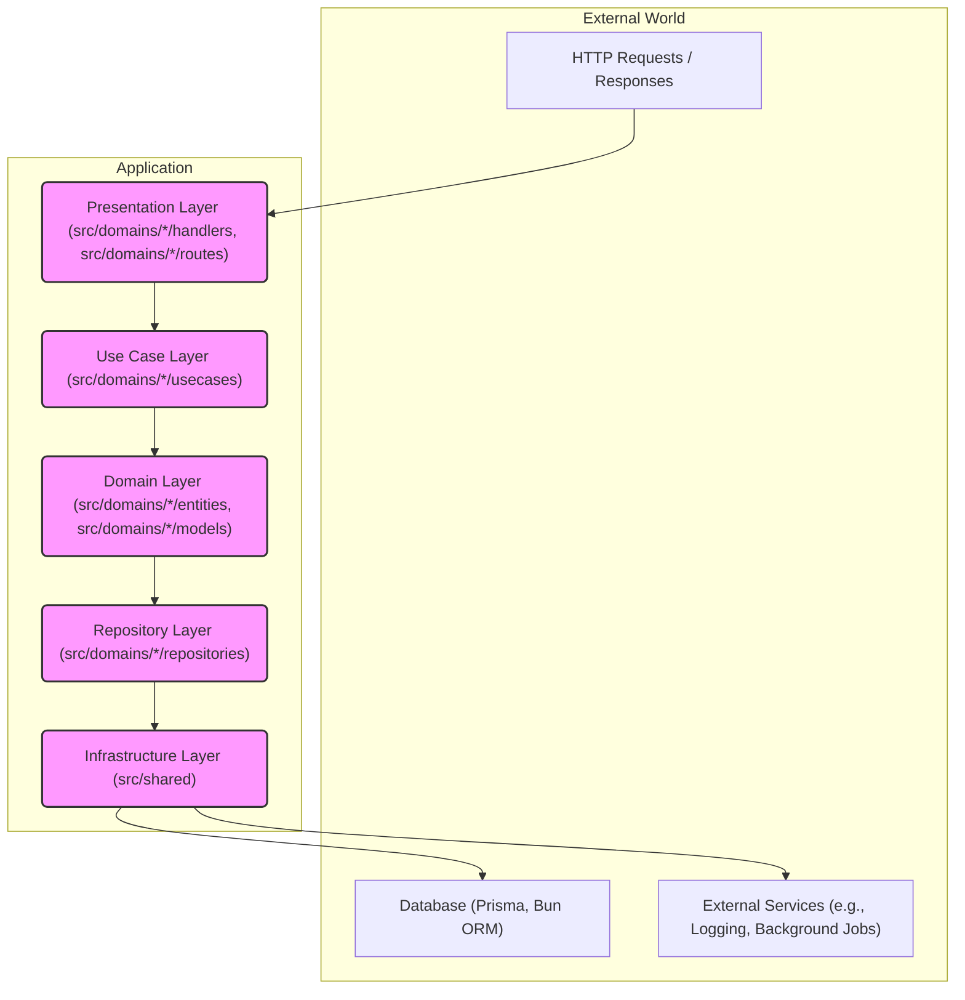

# Hono.js Backend Boilerplate Template

A production-ready backend template built with **Hono.js** on the **Bun** runtime, following **Clean Architecture** principles and **SOLID** design patterns.

## 🚀 Features

- **Fast Runtime**: Built on Bun for superior performance
- **Clean Architecture**: Layered architecture with clear separation of concerns
- **Type Safety**: Full TypeScript support throughout the stack
- **Dependency Injection**: Using tsyringe for loose coupling
- **Database Integration**: Prisma ORM with SQLite (easily switchable)
- **JWT Authentication**: Ready-to-use auth system with middleware
- **Testing Setup**: Bun test runner with example tests
- **Code Quality**: ESLint + Prettier configuration
- **Docker Support**: Multi-stage Dockerfile and Docker Compose
- **API Documentation**: Structured with example domains

## 🏗️ Architecture

This boilerplate follows **Clean Architecture** principles with **Domain-Driven Design (DDD)**, adopting a **mono-repo structure** where each domain is a self-contained module with its own layered architecture.

### High-Level Folder Structure

```
.
├── prisma/                     # Database schema and migrations
│   ├── schema.prisma           # Prisma schema definition
│   └── migrations/             # Database migration files
├── src/
│   ├── app.ts                  # Hono app and global middleware registration
│   ├── server.ts               # Server startup and entry point
│   ├── domains/                # Domain-specific modules (mono-repo approach)
│   │   ├── {domain_name}/      # Each domain is a self-contained unit
│   │   │   ├── entities/       # Core domain entities and value objects
│   │   │   ├── usecases/       # Domain-specific business logic
│   │   │   │   └── interfaces/ # Use case interfaces
│   │   │   ├── repositories/   # Domain data access interfaces and implementations
│   │   │   │   └── interfaces/ # Repository interfaces
│   │   │   ├── handlers/       # Domain HTTP handlers (Presentation Layer)
│   │   │   ├── routes/         # Domain-specific route definitions (Presentation Layer)
│   │   │   ├── models/         # DTOs and request/response models
│   │   │   └── tests/          # Domain-specific tests (unit, integration)
│   │   └── ...                 # Other domains
│   ├── shared/                 # Cross-domain shared components (Infrastructure Layer)
│   │   ├── base/               # Base entities, handlers, repository interfaces
│   │   ├── config/             # Application configuration
│   │   ├── container/          # Dependency Injection container setup
│   │   ├── database/           # Prisma client, database connection, base repository implementations
│   │   ├── middleware/         # Authentication, logging, error handling, validation, CORS
│   │   ├── tests/              # Shared test utilities
│   │   ├── types/              # Shared TypeScript types
│   │   └── utils/              # Common utility functions (UUID, response formatting, etc.)
│   └── handler/                # Global handlers (e.g., error handling, not domain-specific)
│   └── repository/             # Global repository interfaces/implementations (less common in mono-repo)
│   └── routes/                 # Global route definitions (e.g., health checks, not domain-specific)
│   └── usecase/                # Global use cases (less common in mono-repo)
├── .env.example                # Environment variables example
├── Dockerfile                  # Docker build instructions
├── docker-compose.yml          # Docker Compose setup for services (e.g., database)
├── package.json                # Project dependencies and scripts
├── tsconfig.json               # TypeScript configuration
└── README.md                   # Project documentation

```

### Clean Architecture Layer Mapping

This project maps the Clean Architecture layers to the mono-repo structure as follows:

- **Presentation Layer**: Handled within each `src/domains/{domain_name}/handlers/` and `src/domains/{domain_name}/routes/`. This layer is responsible for HTTP request handling, parsing input, and formatting responses. Global routes and handlers (e.g., health checks, global error handling) reside directly under `src/routes/` and `src/handler/` respectively.
- **Application/Use Case Layer**: Located in `src/domains/{domain_name}/usecases/`. This layer contains the application-specific business rules and orchestrates the flow of data to and from the domain entities. It defines and implements the use cases of the system.
- **Domain Layer**: Found in `src/domains/{domain_name}/entities/` and `src/domains/{domain_name}/models/`. This is the core of the application, containing the enterprise-wide business rules, entities, and value objects. `src/shared/base/entities/` provides foundational entities.
- **Infrastructure Layer**: Primarily located in `src/shared/`. This layer deals with external concerns such as databases (`src/shared/database/`), external APIs, logging, configuration (`src/shared/config/`), and dependency injection (`src/shared/container/`). Concrete implementations of repository interfaces (defined in the Domain layer) are also found here, often within `src/shared/database/` or specific `src/infrastructure/` subdirectories if they are not domain-specific.
- **Repository Layer**: Interfaces are defined within each domain's `src/domains/{domain_name}/repositories/interfaces/`, acting as contracts for data access. Their concrete implementations reside in `src/shared/database/` or within the domain's `src/domains/{domain_name}/repositories/` if they are specific to that domain's data source and implementation.

### Dependency Boundaries

Dependencies flow inward, meaning outer layers can depend on inner layers, but inner layers cannot depend on outer layers.



### Core Technology Choices

- **Runtime and Web Framework**:
  - **Bun**: Chosen for its ultra-fast JavaScript execution, native TypeScript support, built-in bundler, test runner, and package manager. This reduces toolchain complexity and significantly improves developer velocity by providing an all-in-one JavaScript runtime.
  - **Hono.js**: A lightweight, performant, and TypeScript-first web framework. Its minimal overhead and flexible middleware system make it ideal for building efficient API layers, aligning with the need for high-performance backend services.

- **ORM/Database Access Library**:
  - **Prisma**: A next-generation ORM that provides a type-safe database client and powerful migration capabilities. It abstracts away raw SQL, enabling developers to work with database operations using familiar TypeScript/JavaScript objects.
  - **Bun ORM**: Utilized for scenarios requiring more granular control over SQL queries or for leveraging Bun's native, highly optimized database drivers. This provides flexibility, allowing for performant, type-safe SQL queries where needed, complementing Prisma for higher-level data interactions.
  - **node-pg-migrate / umzug with pg driver**: For robust and flexible database schema evolution. While Prisma Migrate handles basic migrations, these tools offer more advanced control and support for complex migration scenarios, ensuring database changes are managed reliably in production environments.

- **Testing Frameworks (unit & integration)**:
  - **Bun test runner**: Bun's native test runner offers fast execution and integration with the runtime, simplifying the testing setup.
  - **Jest / Sinon**: Used for advanced mocking capabilities, particularly for unit testing business logic in the Use Case layer and abstracting repository dependencies.
  - **pg-mock / Bun query mocking**: For effective isolation and testing of the database layer, allowing simulated database interactions without requiring a live database connection during unit tests.

- **Logging and Monitoring Tools**:
  - **Structured Logging (e.g., Pino, Winston)**: Implementing structured logging with libraries like Pino or Winston is crucial for effective monitoring and debugging in production. Logs should include correlation IDs (e.g., trace IDs, request IDs) to track requests across different services and layers.
  - **Application Performance Monitoring (APM) (e.g., OpenTelemetry)**: Integrating with OpenTelemetry (or similar APM solutions) enables distributed tracing, metrics collection, and comprehensive observability. This is essential for identifying performance bottlenecks, understanding system behavior, and troubleshooting issues in a distributed environment.

- **Background Job Processing System**:
  - **BullMQ / faktory**: For asynchronous task processing, such as sending emails, processing images, or handling long-running computations. These systems provide reliable queues, retry mechanisms, and concurrency control, ensuring that background tasks are processed efficiently and reliably without blocking the main API thread.

- **Containerization and CI/CD Tooling**:
  - **Docker**: For containerizing the application, ensuring consistent environments across development, testing, and production. Dockerfiles are optimized for multi-stage builds to create lean production images.
  - **Docker Compose**: For orchestrating multi-service local development environments (e.g., application, database, Redis).
  - **GitHub Actions / GitLab CI / CircleCI**: For Continuous Integration and Continuous Deployment (CI/CD). These pipelines automate testing, building Docker images, pushing to container registries, and deploying to target environments, ensuring rapid and reliable delivery of new features and updates.

### Rationale for Architectural Decisions

#### Scalability
- **High-performance Runtime & Framework**: Bun's ultra-fast JavaScript engine and Hono.js's minimal overhead enable the backend services to handle a high volume of requests with low latency. This foundation allows for horizontal scaling by simply adding more instances of the application behind a load balancer, without significant performance degradation.
- **Domain-Specific Clean Architecture (Mono-Repo)**: By encapsulating each domain with its own complete Clean Architecture, the system is inherently modular. This design allows for independent development, testing, and even potential independent deployment (e.g., as serverless functions or microservices) of specific domains if needed in the future, facilitating granular scaling and resource allocation based on domain-specific load.
- **Flexible Data Layer**: The combination of Prisma and Bun ORM provides the best of both worlds: high-level, type-safe ORM capabilities for common CRUD operations and the flexibility to drop to lower-level, optimized SQL queries when performance is critical. This ensures efficient data access, which is crucial for scalability under heavy database load. Support for advanced migration tools guarantees robust database evolution without downtime.

#### Maintainability
- **Strict TypeScript Usage**: Enforcing TypeScript in strict mode across the entire codebase significantly reduces runtime errors by catching type mismatches and logical inconsistencies at compile-time. This leads to more robust code, easier debugging, and improved developer confidence when refactoring or extending existing functionalities.
- **Layered, Interface-Driven Design**: The strict separation of concerns into Presentation, Use Case, Domain, Repository, and Infrastructure layers, combined with dependency injection via interfaces (`tsyringe`), ensures that each component has a single responsibility. This modularity makes the codebase easier to understand, test, and maintain. Changes in one layer (e.g., switching databases) have minimal impact on other layers, as long as interfaces are respected.
- **Shared Infrastructure Modules**: Centralizing cross-cutting concerns like authentication, logging, configuration, and utility functions within `src/shared/` prevents code duplication and enforces consistency. This approach streamlines maintenance efforts, as updates or bug fixes to these common functionalities only need to be applied in one place.

#### Developer Experience
- **Built-in Tooling (Bun)**: Bun's integrated bundler, test runner, and package manager significantly simplify the developer's toolchain setup. This "zero-config" approach reduces the time spent on environment setup and configuration, allowing developers to be productive almost immediately. Features like hot reload further enhance the development loop, providing instant feedback on code changes.
- **Standardized Workflows**: Pre-configured scripts for development, testing, linting, formatting, database management (Prisma migrations), and Docker operations provide a consistent and predictable development workflow. This reduces cognitive load, minimizes "it works on my machine" issues, and ensures that all team members follow the same best practices, leading to higher code quality and faster feature delivery.
- **Comprehensive Documentation & Patterns**: The README, Memory Bank documentation, and the inclusion of example domains (Auth, Greeting, Posts) serve as living documentation and practical examples of the architectural patterns. This accelerates onboarding for new team members and provides quick reference for existing developers, fostering a shared understanding of the codebase and its design principles.

These architectural decisions and technology choices are strategically aligned to provide a robust, high-performance, and easily maintainable backend template that significantly enhances developer productivity and supports the long-term growth and evolution of the application.

## 🔧 Quick Start

### Prerequisites

- [Bun runtime](https://bun.sh) installed
- Docker (optional, for containerized development)

### Installation

1. **Install dependencies**
   ```bash
   bun install
   ```

2. **Set up environment**
   ```bash
   cp .env.example .env
   # Edit .env with your configuration
   ```

3. **Initialize database**
   ```bash
   bun prisma generate
   bun prisma migrate dev
   ```

4. **Start development server**
   ```bash
   bun run dev
   ```

Open [http://localhost:3000](http://localhost:3000)

## 📝 Available Scripts

| Command | Description |
|---------|-------------|
| `bun run dev` | Start development server with hot reload |
| `bun test` | Run test suite |
| `bun test:watch` | Run tests in watch mode |
| `bun run lint` | Check code style with ESLint |
| `bun run format` | Format code with Prettier |
| `bun run db:generate` | Generate Prisma client |
| `bun run db:migrate` | Run database migrations |
| `bun run docker:build` | Build Docker image |
| `bun run docker:up` | Start with Docker Compose |

## 🔐 API Endpoints

### Authentication
- `POST /auth/register` - User registration
- `POST /auth/login` - User login
- `GET /auth/profile` - Get user profile (protected)

### Greeting (Example Domain)
- `GET /greeting` - Get greeting message
- `POST /greeting` - Create new greeting

### Posts (Example Domain)
- `GET /posts` - Get all posts
- `GET /posts/:id` - Get post by ID
- `GET /posts/author/:authorId` - Get posts by author
- `POST /posts` - Create post (protected)
- `PUT /posts/:id` - Update post (protected)
- `DELETE /posts/:id` - Delete post (protected)

## 🏛️ Adding New Domains

Follow these steps to add a new domain:

1. **Define Domain Model** (`src/domain/models/`)
2. **Create Repository Interface** (`src/repository/interfaces/`)
3. **Implement Repository** (`src/repository/`)
4. **Create Use Case Interface** (`src/usecase/interfaces/`)
5. **Implement Use Case** (`src/usecase/`)
6. **Create Handler** (`src/handler/`)
7. **Define Routes** (`src/routes/`)
8. **Register in DI Container** (`src/infrastructure/container/`)
9. **Add Routes to App** (`src/routes/index.ts`)

## 🐳 Docker Development

### Using Docker Compose (Recommended)
```bash
bun run docker:up      # Start all services
bun run docker:logs    # View logs
bun run docker:down    # Stop all services
```

### Building Docker Image
```bash
bun run docker:build
bun run docker:run
```

## 🧪 Testing

Run the test suite:
```bash
bun test
```

Tests are organized by domain and include:
- Unit tests for repositories and use cases
- Integration tests for API endpoints
- Handler tests for HTTP logic

## 📄 Environment Variables

```env
NODE_ENV=development
PORT=3000
CORS_ORIGIN=*
JWT_SECRET=your_jwt_secret_here
JWT_EXPIRES_IN=24h
DATABASE_URL="file:./dev.db"
```

## 🛠️ Tech Stack

- **Runtime**: Bun
- **Framework**: Hono.js
- **Language**: TypeScript
- **Database**: Prisma ORM (SQLite default)
- **DI Container**: tsyringe
- **Authentication**: jsonwebtoken
- **Testing**: Bun test runner
- **Code Quality**: ESLint + Prettier
- **Containerization**: Docker

## 📚 Documentation

- [Bun Documentation](https://bun.sh/docs)
- [Hono.js Documentation](https://hono.dev/docs)
- [Prisma Documentation](https://www.prisma.io/docs)

## 📜 License

This project is licensed under the MIT License - see the [LICENSE](LICENSE) file for details.

---

**Built with ❤️ by Zercle Technology Co., Ltd.**
